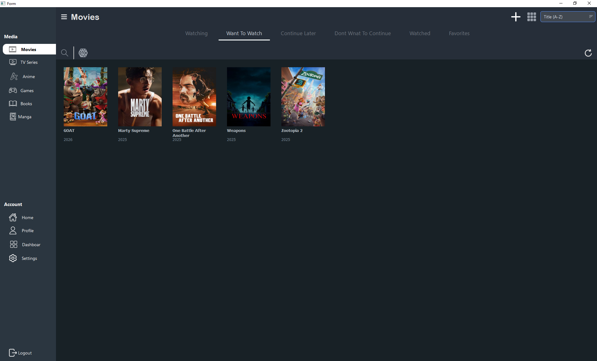
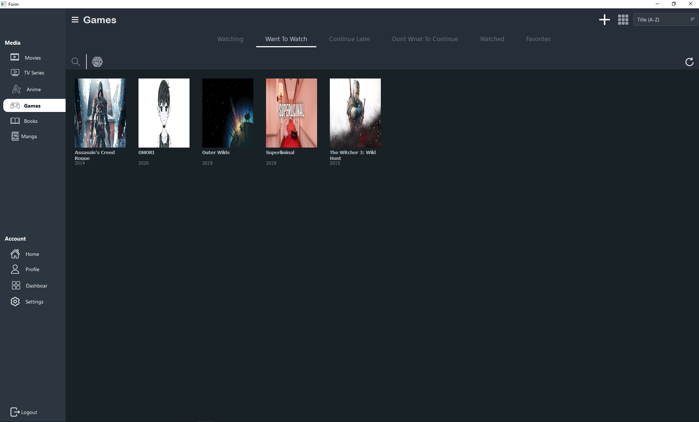
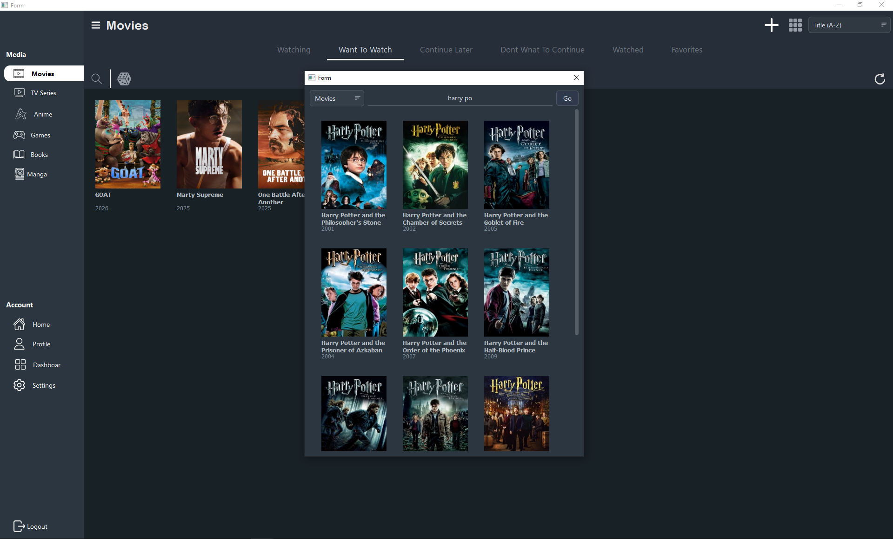
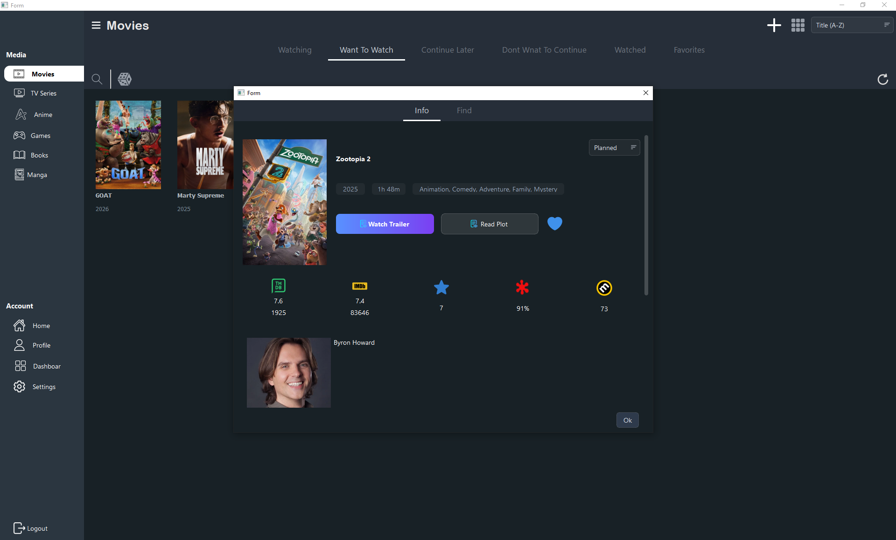

# Library GUI

[](https://github.com/ahmed-x-dev/libirary_GUI/releases)
[](https://www.python.org/downloads/)
[](https://pypi.org/project/PySide6/)
[](https://github.com/ahmed-x-dev/libirary_GUI/releases/latest)

A modern, feature-rich **PySide6 desktop client** for managing your personal media library. Connect to the Library backend API to securely log in, browse, search, and organize all your media—from movies and series to games, books, manga, and anime—by custom status categories.

**[→ View on GitHub](https://github.com/ahmed-x-dev/libirary_GUI)** • **[⬇️ Download Latest Release](https://github.com/ahmed-x-dev/libirary_GUI/releases/latest)**

## Table of Contents

- [Features](#features)
- [Screenshots](#screenshots)
- [Quick Start](#quick-start)
- [Tech Stack](#tech-stack)
- [Architecture](#architecture)
- [Requirements](#requirements)
- [Installation](#installation)
- [Usage](#usage)
- [Configuration](#configuration)
- [Project Structure](#project-structure)
- [Data Storage](#data-storage)
- [Development](#development)
- [Troubleshooting](#troubleshooting)
- [FAQ](#faq)
- [Contributing](#contributing)
- [License](#license)

## Features

**Core Media Management**
- 📚 **Multi-Category Support**: Organize content across movies, series, games, books, manga, and anime
- 🏷️ **Smart Status Management**: Categorize items into in progress, planned, on hold, dropped, completed, and favorites
- 🎯 **Flexible Viewing**: Switch between grid and list views with customizable sorting options
- ⭐ **Rich Detail View**: Rate items, mark as favorites, and view comprehensive media information

**Discovery & Search**
- 🔍 **Advanced Search**: Debounced search with live previews for faster discovery
- 🎲 **Quick Random Pick**: Get random recommendations from each status section
- 🎬 **External Links**: Quick access to streaming sites (Cineby, VidSrc, ArabSeed, Akwam)
- 👥 **Cast Information**: View cast details for movies and shows

**User Experience**
- 🔒 **Secure Sessions**: Automatic session refresh with encrypted token storage
- 🔄 **Auto-Updates**: Built-in update checker with GitHub Release integration
- 💾 **Persistent Settings**: UI preferences saved and restored automatically
- ⚡ **Responsive UI**: Async operations ensure the interface never freezes

## Screenshots

Get a glimpse of the application interface:

### Main Library View
Browse your media collection with beautiful grid or list layouts. Navigate between categories (Movies, Series, Games, Books, Manga, Anime) and organize by status sections.

| Movies View | Games View |
|------------|-----------|
|  |  |

### Search & Discovery
Easily find content with debounced search. Results update in real-time as you type, making it quick to locate exactly what you're looking for.

Search Dialog & Search Results 



### Media Details & Information
View comprehensive information about each media item including cast, ratings, genres, and year. Rate items, mark as favorites, and access external streaming links.

Detail View




## Quick Start

### Install & Run (2 minutes)

```bash
# 1. Clone the repository
git clone https://github.com/ahmed-x-dev/libirary_GUI.git
cd libirary_GUI

# 2. Create and activate virtual environment
python -m venv venv
.\venv\Scripts\Activate.ps1  # Windows PowerShell
# source venv/bin/activate   # macOS/Linux

# 3. Install dependencies
pip install -r requirements.txt

# 4. Run the app
python main.py
```

**Next**: Configure the API endpoint (see [Configuration](#configuration) section)

## Tech Stack

| Layer | Technology | Purpose |
|-------|-----------|---------|
| **UI Framework** | PySide6 | Cross-platform Qt desktop framework with modern Python bindings |
| **Async Runtime** | qasync | Seamless async/await integration with Qt's event loop |
| **HTTP Client** | httpx | Modern async HTTP library for API communication |
| **Security** | keyring | OS-level credential storage (encrypted) |
| **Architecture** | MVP Pattern | Model-View-Presenter for clean separation of concerns |

## Architecture

This project follows the **Model-View-Presenter (MVP)** architectural pattern:

```
┌─────────────────────────────────────────┐
│          User Interaction               │
└──────────────┬──────────────────────────┘
               │
       ┌───────▼────────┐
       │  Views (PySide6)│ ◄── UI Components
       └───────┬────────┘
               │ (Signals/Slots)
       ┌───────▼────────────┐
       │  Presenters (Logic)│ ◄── Business Logic
       └───────┬────────────┘
               │ (API Calls)
       ┌───────▼────────┐
       │  Services      │ ◄── API & Auth
       │ └─ API Client  │
       │ └─ Auth        │
       │ └─ Media Ops   │
       └────────────────┘
```

**Benefits:**
- ✅ **Testability**: Logic is decoupled from UI
- ✅ **Maintainability**: Clear separation of concerns
- ✅ **Scalability**: Easy to add new features
- ✅ **Async-First**: All network calls run off the main thread

## Requirements

- **Python 3.8+** (recommend 3.10+)
- **Active Library Backend API** (see Configuration)

## Installation

### Prerequisites

- Python 3.8 or higher
- Git (for cloning the repository)
- An accessible Library backend API instance

### Step-by-Step Setup

#### 1️⃣ Clone the Repository

```bash
git clone https://github.com/ahmed-x-dev/libirary_GUI.git
cd libirary_GUI
```

#### 2️⃣ Create Virtual Environment

```bash
# Create virtual environment
python -m venv venv

# Activate on Windows PowerShell
.\venv\Scripts\Activate.ps1

# Activate on Windows CMD
.\venv\Scripts\activate

# Activate on macOS/Linux
source venv/bin/activate
```

#### 3️⃣ Install Dependencies

```bash
pip install -r requirements.txt
```

#### 4️⃣ Configure Environment

Copy the example configuration file and update with your settings:

```bash
# Copy the example .env file
cp .env.example .env
```

Edit `.env` and configure your API endpoint:

```env
# .env
API_BASE_URL=http://localhost:8000/v1/
# Or for production/remote server:
# API_BASE_URL=https://your-api-endpoint.com/v1/
```

#### 5️⃣ Run the Application

```bash
python main.py
```

**First Launch**: You'll be prompted to log in with your Library backend credentials.

## Usage

Once launched, the application presents the following workflow:

### Main Workflow

1. **🔑 Log In** - Authenticate using your Library backend credentials
2. **📚 Browse** - Explore your media library by:
   - Selecting categories (Movies, Series, Games, Books, Manga, Anime)
   - Filtering by status (In Progress, Planned, On Hold, Dropped, Completed, Favorites)
   - Choosing between grid or list view
3. **🔍 Search** - Use the search bar for quick lookups
   - Queries are debounced to avoid excessive API calls
   - Results update in real-time as you type
4. **⭐ Organize** - Click on any media item to:
   - View detailed information and cast
   - Rate the media (1-10 stars)
   - Mark as favorite
   - Add external links for streaming
5. **🎬 Share** - Access streaming sites directly through external links

### Keyboard Shortcuts

| Action | Shortcut |
|--------|----------|
| Search | `Ctrl+F` |
| Refresh | `Ctrl+R` |
| Logout | `Ctrl+Q` |

*(Note: Check the main menu for platform-specific shortcuts)*

## Configuration

All configuration is managed through environment variables in the `.env` file. This keeps sensitive data out of version control and makes it easy to switch between environments.

### Setup

1. Copy the example configuration:
   ```bash
   cp .env.example .env
   ```

2. Edit `.env` with your settings (see options below)

### Environment Variables

#### API Configuration

| Variable | Default | Description | Example |
|----------|---------|-------------|---------|
| `API_BASE_URL` | `http://127.0.0.1:8000/v1/` | Library backend API endpoint | `https://api.example.com/v1/` |
| `API_TIMEOUT` | `10` | HTTP request timeout (seconds) | `15` |
| `API_MAX_CONNECTIONS` | `20` | Max concurrent connections | `50` |

**Example for local development:**
```env
API_BASE_URL=http://127.0.0.1:8000/v1/
API_TIMEOUT=10
```

**Example for production:**
```env
API_BASE_URL=https://library-api.example.com/v1/
API_TIMEOUT=30
API_MAX_CONNECTIONS=50
```

#### GitHub Configuration (Auto-Updates)

| Variable | Default | Description |
|----------|---------|-------------|
| `GITHUB_USER` | `ahmed-x-dev` | GitHub username for update checks |
| `GITHUB_REPO` | `libirary_GUI` | Repository name |

```env
GITHUB_USER=ahmed-x-dev
GITHUB_REPO=libirary_GUI
```

#### Security Configuration

| Variable | Default | Description |
|----------|---------|-------------|
| `KEYRING_SERVICE_NAME` | `MyLibraryApp` | OS keyring service identifier |
| `DEVICE_ID_FILE` | `.library_app_device_id` | Device ID storage location |

**Note**: Refresh tokens are encrypted and stored in your OS keyring:
- **Windows**: Credential Manager
- **macOS**: Keychain
- **Linux**: pass or other configured backend

#### Application Configuration

| Variable | Default | Description |
|----------|---------|-------------|
| `LOG_LEVEL` | `INFO` | Logging level (DEBUG, INFO, WARNING, ERROR, CRITICAL) |
| `APP_NAME` | `MyLibraryApp` | App name for preferences storage |
| `APP_ORG` | `MyLib` | Organization name for preferences |
| `DEBUG` | `false` | Enable debug mode |

```env
# Development
LOG_LEVEL=DEBUG
DEBUG=true

# Production
LOG_LEVEL=INFO
DEBUG=false
```

### Security Best Practices

⚠️ **Important**: The `.env` file contains sensitive configuration and is automatically ignored by Git (see `.gitignore`).

- ✅ Never commit `.env` to version control
- ✅ Use `.env.example` to document required variables
- ✅ Use different `.env` files for different environments (dev, staging, prod)
- ✅ Refresh tokens are encrypted and stored in OS keyring, not in `.env`

## Project Structure

### Directory Overview

```
libirary_GUI/
├── app/                              # 🎯 Main Application Code
│   ├── api/                          # 🔌 API Integration Layer
│   │   ├── api_client.py            # Core HTTP client for backend
│   │   ├── auth_service.py          # Authentication & session management
│   │   ├── users_service.py         # User account operations
│   │   ├── media_service.py         # Media CRUD operations
│   │   ├── user_media_service.py    # User library operations
│   │   └── __init__.py
│   │
│   ├── models/                       # 📊 Data Models
│   │   ├── models.py                # Pydantic models for type safety
│   │   └── __init__.py
│   │
│   ├── presenters/                   # 🧠 Business Logic (MVP)
│   │   ├── main_window_presenter.py # Main window logic
│   │   ├── register_presenter.py    # Login/registration logic
│   │   ├── search_presenter.py      # Search functionality
│   │   ├── show_presenter.py        # Show details logic
│   │   └── __init__.py
│   │
│   ├── views/                        # 🎨 UI Components (MVP)
│   │   ├── main_window_view.py      # Main interface
│   │   ├── register_view.py         # Login window
│   │   ├── search_view.py           # Search dialog
│   │   ├── show_view.py             # Detail view
│   │   ├── cast_view.py             # Cast information
│   │   ├── user_rating_view.py      # Rating interface
│   │   ├── media_delegate.py        # Custom list item renderer
│   │   └── __init__.py
│   │
│   ├── services/                     # 🔧 Service Providers
│   │   ├── providers.py             # Dependency injection
│   │   └── __init__.py
│   │
│   ├── utils/                        # 🛠️ Helper Utilities
│   │   ├── app_settings.py          # Settings management
│   │   ├── dialog_helpers.py        # Dialog utilities
│   │   ├── image_loader.py          # Async image loading
│   │   ├── loading_spinner.py       # Loading animation
│   │   ├── movies_fetch.py          # Media fetching logic
│   │   ├── multi_filter_proxy.py    # Advanced filtering
│   │   ├── my_functions.py          # Common functions
│   │   ├── refresh_token_store.py   # Token management
│   │   └── __init__.py
│   │
│   ├── styles/                       # 🎨 UI Styling
│   │   └── __init__.py
│   │
│   └── __init__.py
│
├── resources/                        # 📦 Qt Resources & UI Files
│   ├── ui/                          # Designer-created .ui files
│   │   ├── main_ui.ui               # Main window UI definition
│   │   ├── search_ui.ui             # Search dialog UI
│   │   ├── show_ui.ui               # Show details UI
│   │   ├── register.ui              # Login form UI
│   │   ├── user_rating_ui.ui        # Rating UI
│   │   ├── add_ui.ui                # Add item UI
│   │   ├── card.ui                  # Card component UI
│   │   └── ep_ui.ui                 # Episode UI
│   │
│   ├── py_ui/                       # Generated Python UI modules
│   │   ├── main_ui.py               # Compiled from main_ui.ui
│   │   ├── search_ui.py             # Compiled from search_ui.ui
│   │   └── ...
│   │
│   ├── Icons/                       # 🖼️ Application Icons
│   │
│   ├── resources.qrc                # Qt resource definition
│   ├── resources_rc.py              # Compiled resources
│   │
│   └── __init__.py
│
├── main.py                          # 🚀 Application Entry Point
├── updater.py                       # 🔄 Update Checker & Installer
├── version.py                       # 📌 Version Information
├── requirements.txt                 # 📋 Python Dependencies
├── README.md                        # 📖 Documentation
├── .git/                            # Git repository
├── .gitignore                       # Git ignore rules
├── .github/                         # GitHub workflows
├── .vscode/                         # VS Code settings
└── venv/                            # Virtual environment
```

### Key Modules Explained

| Module | Purpose | Key Files |
|--------|---------|-----------|
| **api** | Backend communication | `api_client.py`, `auth_service.py` |
| **models** | Data structures | `models.py` |
| **presenters** | Business logic | Handles events and state |
| **views** | UI components | PySide6 Qt widgets |
| **services** | Dependency injection | `providers.py` |
| **utils** | Helper functions | Async utilities, storage, etc. |

## Data Storage

The application securely stores information across different mechanisms:

| Data | Location | Security |
|------|----------|----------|
| **Refresh Token** | OS Keychain | Encrypted (keyring) |
| **Device ID** | `~/.library_app_device_id` | File-based |
| **UI Settings** | Qt QSettings | System registry/config |

**Keyring Service Name**: `MyLibraryApp`

## Development

### Set Up Development Environment

```bash
# Create and activate virtual environment as shown above
python -m venv venv
source venv/bin/activate  # or .\venv\Scripts\Activate.ps1 on Windows

# Install development dependencies (includes testing tools)
pip install -r requirements.txt

# Optional: Install code formatting tools
pip install black flake8 pylint
```

### Project Architecture Notes

**MVP Pattern Implementation:**
- **Views** (`views/`) - Pure UI components, no business logic
- **Presenters** (`presenters/`) - Connect views to services, handle user interactions
- **Services** (`services/`) - Provide API clients and external services
- **Models** (`models/`) - Define data structures for type safety

**Async/Await Pattern:**
- All API calls are async (using `qasync` for Qt integration)
- UI updates happen via Qt signals/slots on the main thread
- Heavy operations run in background threads

### Common Development Tasks

**Generating UI Files from Designer**
```bash
cd resources
pyside6-uic ui/main_ui.ui -o py_ui/main_ui.py
```

**Regenerating Resource Files**
```bash
cd resources
pyside6-rcc resources.qrc -o resources_rc.py
```

## Troubleshooting

### Qt Thread-Affinity Errors

**Problem**: You see errors about Qt objects being accessed from wrong thread.

**Solution**: Ensure all UI objects are created and modified on the main thread. Network calls should run in background threads via `qasync`, while dialogs, widgets, and UI updates must happen on the main thread.

```python
# Correct: Heavy lifting in async, UI updates on main thread
async def fetch_and_update():
    data = await api.fetch_media()  # Background thread
    self.update_ui(data)  # Runs on main thread via signal/slot
```

### Keyring Errors on Linux

**Problem**: `keyring.errors.InitError` on headless Linux systems.

**Solution**: Install and configure a keyring backend:

```bash
# For headless systems, try pass or file backends
pip install keyrings.pass  # or keyrings.cryptfile
```

### API Connection Issues

**Problem**: Cannot connect to backend API.

**Solution**:
- Verify the API base URL is correct in `app/api/api_client.py`
- Check that the backend service is running and accessible
- Review firewall/proxy settings
- Check application logs for detailed error messages

## FAQ

### General Questions

**Q: What Python version do I need?**  
A: Python 3.8 or higher. We recommend 3.10+ for best performance and compatibility.

**Q: Can I use this on macOS/Linux?**  
A: Yes! The application is cross-platform. Just follow the macOS/Linux activation steps during setup.

**Q: How do I update the application?**  
A: The app checks for updates automatically on launch. You'll receive a notification if a new version is available with a direct download link.

### Backend Integration

**Q: What if I don't have a Library backend?**  
A: You'll need to set up the [Library backend API](https://github.com/ahmed-x-dev/libirary) first. Check its documentation for setup instructions.

**Q: How do I change the API endpoint?**  
A: Edit `app/api/api_client.py` and update the `base_url` parameter.

**Q: Does the app work offline?**  
A: No, it requires an active connection to the Library backend API.

### Security

**Q: Where is my refresh token stored?**  
A: In your OS keyring (Windows: Credential Manager, macOS: Keychain, Linux: pass or similar).

**Q: Is my password saved?**  
A: Only the refresh token is saved. Your password is used once to authenticate and is never stored.

**Q: Can I use this over the internet?**  
A: Yes, as long as your Library backend is accessible and uses HTTPS.

## Contributing

### How to Contribute

We'd love your help! Whether it's bug fixes, features, or documentation improvements:

1. **Fork the repository**  
   Click the fork button on [GitHub](https://github.com/ahmed-x-dev/libirary_GUI)

2. **Clone your fork**  
   ```bash
   git clone https://github.com/YOUR-USERNAME/libirary_GUI.git
   cd libirary_GUI
   ```

3. **Create a feature branch**  
   ```bash
   git checkout -b feature/your-feature-name
   ```

4. **Make your changes**  
   - Follow the MVP architecture pattern
   - Write clear, commented code
   - Test on your changes thoroughly

5. **Commit with descriptive messages**  
   ```bash
   git commit -m "Add feature: clear description of what changed"
   ```

6. **Push to your fork**  
   ```bash
   git push origin feature/your-feature-name
   ```

7. **Open a Pull Request**  
   Go to the original repository and click "Create Pull Request"

### Development Guidelines

- **Code Style**: Follow PEP 8 standards
- **Architecture**: Use the MVP pattern (don't break separation of concerns)
- **Async**: All API calls should be async
- **Testing**: Test your changes on multiple platforms if possible
- **Documentation**: Update docstrings and README if needed

### Reporting Issues

Found a bug? Please report it:
1. Check if the issue already exists
2. Provide a clear description
3. Include steps to reproduce
4. Share your OS and Python version
5. Attach error logs if possible

## License

This project is **free for personal use only**. See the LICENSE file for full details.

### Usage Rights

- ✅ Personal projects
- ✅ Learning and experimentation
- ✅ Educational purposes
- ❌ Commercial use without explicit permission

For commercial licensing inquiries, please contact the project maintainer.

---

## Resources & Support

### Documentation

- [PySide6 Documentation](https://doc.qt.io/qtforpython/)
- [Qt Designer Guide](https://doc.qt.io/qt-6/qtdesigner-manual.html)
- [qasync GitHub](https://github.com/CogentApps/qasync)
- [httpx Documentation](https://www.python-httpx.org/)
- [keyring Documentation](https://keyring.readthedocs.io/)

### Related Projects

- **[Library Backend API](https://github.com/ahmed-x-dev/libirary)** - The backend this app connects to
- **[Qt for Python](https://wiki.qt.io/Qt_for_Python)** - Official PySide6 wiki

### Getting Help

- 📝 **Check the FAQ** above for common questions
- 🐛 **Report bugs** on [GitHub Issues](https://github.com/ahmed-x-dev/libirary_GUI/issues)
- 💬 **Ask questions** in GitHub Discussions (if enabled)
- 📧 **Contact** the maintainer for urgent issues

## Acknowledgments

- Built with [**PySide6**](https://wiki.qt.io/Qt_for_Python) - Qt for Python
- Async support from [**qasync**](https://github.com/CogentApps/qasync)
- HTTP client [**httpx**](https://www.python-httpx.org/)
- Secure storage via [**keyring**](https://github.com/jaraco/keyring)
- Inspired by modern desktop application patterns

## Changelog

See [CHANGELOG.md](CHANGELOG.md) for version history and upcoming features.

## Status

**Current Version**: 0.3.0  
**Last Updated**: April 2026  
**Maintenance**: Active  

---

**Made with ❤️ by [Ahmed](https://github.com/ahmed-x-dev)**
